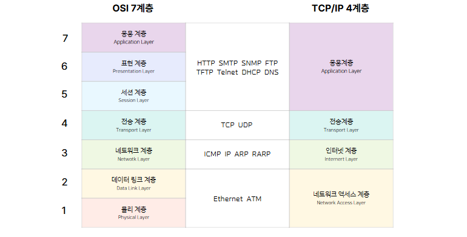

# iot-network-2025
IoT 네트워크 프로그래밍 리포지토리 

## 1일차

### 소켓
#### 소켓 통신 개념
- 이더넷 방식 사용
- TCP (Transmission Control Protocol)
    - 연결 지향형 : SOCK_STREAM
    - 신뢰성 있는 메시지 및 파일 전송에 적합
- UDP(User Datagram Protocol)
    - 비연결 지향형 : SOCK_DGRAM
    - 방송 및 빠른 전송에 적합. 신뢰성 낮음

#### 소켓 통신 흐름
1. socket() : 소켓 생성
2. bind() : 소켓에 IP주소/포트 할당
3. listen() : 연결 요청 대기
4. accept() : 연결 허용, 새 소켓 생성
5. read()/write() : 데이터 송/수신
6. close() : 소켓 종료

- 위는 TCP 소켓에 해당하는 과정, UDP는 listen(), accept() 없음!
- UDP : socket() -> bind() -> sendto() / recvfrom()

### 네트워크 기본 개념
- 네트워크(Network) : Net + Work 합성어. 여러 대의 컴퓨터가 연결된 시스템
- 클라이언트(Client) : 서비스를 요청하는 쪽
- 서버(Server) : 서비스를 제공하는 쪽
- IP 주소 : 컴퓨터의 고유한 주소
- 포트(Port) : 호스트 내 프로세스를 구분하는 번호(서비스 식별자)

### 프로토콜 체계
- PF_INET : IPv4 인터넷 프로토콜 체계
- PF_INET6 : IPv6 인터넷 프로토콜 체계

#### IPv4 주소 체계
- 클래스 A : 네트워크 ID(1) + 호스트 ID(3), 0 ~ 127 이하 (0)
- 클래스 B : 네트워크 ID(2) + 호스트 ID(2), 128 ~ 191 이하 (10)
- 클래스 C : 네트워크 ID(3) + 호스트 ID(1), 192 ~ 223 이하 (110)
- 클래스 D : - , 224 ~ 229 이하 (1110)
- 클래스 E : - , 240 ~ 255 이하 (1111)
- IP 주소의 네트워크 ID 동일하면 같은 네트워크 상에 있다고 볼 수 있음

### 개발환경
#### 리눅스 개발 환경 설정
- VMware 설치 : 회원가입 필요
    - https://www.broadcom.com/
    - 가상환경 생성

- Ubuntu 설치
    - https://ubuntu.com/download

- VMware 터미널 시작하기
    - sudo apt install net-tools
    - sudo apt install openssh-server
    - sudo apt install gcc
    - sudo apt update
    - sudo apt upgrade

- Putty 설치
    - https://www.putty.org/
    - 푸티 설정 : ifconfig로 IP 주소 확인

#### Docker와 VMware 차이
- Docker : 운영체제 레벨 가상화. OS 공유
- VMware : 하드웨어 레벨 가상화. OS 독립

### 리눅스 기본 명령어
- . : 현재 폴더
- .. : 상위 폴더
- pwd : 현재 경로
- cd : 해당 폴더로 이동
- cd .. : 상위 폴더로 이동 
- ls [-l] : 현재 폴더 목록
- uname [-a] : 시스템 정보 확인
- mkdir : 폴더 생성
- rm [-fr] : 파일/폴더 삭제
- cp : 파일 복사
- mv : 파일 이동
- nano : 파일 편집
- cat : 파일 내용 출력
- ./[실행파일] : 파일 실행
- clear : 화면 지우기

### 파일 생성 및 컴파일
#### 간단한 파일 생성 및 출력
- 생성 : touch test.txt (비어있음)
- 편집 : nano test.txt
- 출력 : cat test.txt
- 간단한 파일 다룰 때 사용하는 명령어, 자주 사용 안 함.

#### c파일 생성
- 생성 : nano main.c
- 컴파일 : gcc main.c 
    - 실행파일 이름 지정 : gcc main.c -o main, 기본 a.out
- 실행 : ./main

#### 기본 라이브러리
- <stdio.h> : 입출력 함수
    - perror() : 시스템 에러 메세지 출력
- <stdlib.h> : 동적 메모리, 종료 함수(exit), 숫자 변환 함수 등
- <string.h> : 문자열 처리 함수
- <unistd.h> : 유닉스 시스템 함수(read, write, open, close, sleep ...)
- <fcntl.h> : 파일 제어 함수
    - O_RDONLY : 읽기 전용 모드
    - O_WRONLY : 쓰기 전용 모드
    - O_RDWR : 읽기 + 쓰기 모드
    - O_CREAT : 파일이 없으면 새로 생성
    - O_TRUNC : 파일 열 때 기존 내용 모두 지우고 새로 시작
    - O_APPEND : 파일 끝에 데이터 추가

##### Little Endian
-  작은 주소에 작은 값이 저장되는 방식

##### Chmod
- 권한 설정 명령어
    - 읽기 : 4
    - 쓰기 : 2
    - 실행 : 1
- 소유자(user) - 그룹(group) - 기타(others)


## 2일차
### OSI 7계층 TCP/IP 4계층 비교


### 소켓 구조체 
#### 기본 구조
``` c
struct sockaddr_in {
    unsigned short sin_family;  // IPv4 주소 체계 (AF_INET)
    struct in_addr sin_addr;    // IP 주소
    uint16_t sin port;          // Port
}
```
- 필요 라이브러리
    -  <arpa/inet.h> : 주소 변환 함수 (inet_addr, inet_aton)
- memset() : 구조체를 0으로 초기화 하는 데 사용. 쓰레기 값 제거 

#### 바이트 정렬 함수
- htons(), htonl() : 호스트 바이트 정렬 -> 네트워크 바이트 정렬
- ntohs(), ntohl() : 네트워크 바이트 정렬 -> 호스트 바이트 정렬

#### IP 주소 변환 함수
- inet_pton() : 문자열 -> 숫자(네트워크 바이트 정렬)
- inet_ntop() : 숫자 -> 문자열
- inet_addr() : 문자열 -> 숫자 (IPv4만 지원)
- inet_ntoa() : 숫자 -> 문자열 (IPv4만 지원)

### 소켓 실습
#### Client
```c
if(connect(sock_fd, (struct sockaddr*)&server_addr, sizeof(server_addr)) == -1){
		close(sock_fd);
		exit(1);
	}
```
- connect() : 서버에 연결 요청
- 실행 : ./base_client 127.0.0.1 9090
- [base_client](./Socket/Chapter2/base_client.c)
- [echo_client](./Socket/Chapter2/echo_client.c)

#### Server
```c
if((client_fd = accept(server_fd, (struct sockaddr*)&client_addr, &client_addr_len)) == -1){
    perror("accept failed");
    close(server_fd);
    exit(1);
}
```
- accept : 클라이언트의 요청 수락
- 실행 : ./base_server 9090
- [base_server](./Socket/Chapter2/base_server.c)
- [echo_server](./Socket/Chapter2/echo_server.c)

    
## 3일차
### TCP
#### TCP 동작 구조
- Client -> Server 데이터 전송
- 사진으로 설명

#### TCP가 신뢰성 있는 이유
- 정리해서 작성

### 도메인 이름으로 IP 변환

### 소켓 옵션
- [소켓옵션](./Socket/Chapter3/socketopt.c)


아크?
UDP 소켓 통신

TCP UDP 전송방식 차이
TCP가 신뢰성 있는 이유 : 데이터 손실이 일어나면 재전송
UDP -> 데이터 잘 받았는지 아닌지 신경 안 쓰고 데이터 막 보냄
TIMEOUT
TCP -> 데이터 보냄 -> 아크 확인 -> 데이터 재송신 또는 다음 데이터 ㅈ보냄
UDP -> 아크 상관 안 하고 막 보냄

4핸드 쉐이킹 -> TCP가 소켓을 끊을 때 데이터를 4번 주고 받음 -> 데이터 손실 방지 위함
-> 교재 98p 참고

#include <netdb.h>

도메인으로 IP주소 얻기

### 소켓옵션
- so_reuseaddr : 소켓 주소 재사용
- so keepalive
- tcp_nodeLay

### 다중 접속 서버 (Multi-Client-Server) -> PPT 참고 .. 계속
- 멀티 프로세스 
    - fork
    - 관련 매크로 함수
        - WIFEXITED ....
- 멀티 플렉싱
- 멀티 스레딩


## 4일차
### 다중 접속서버 (Multi-Client-Server)